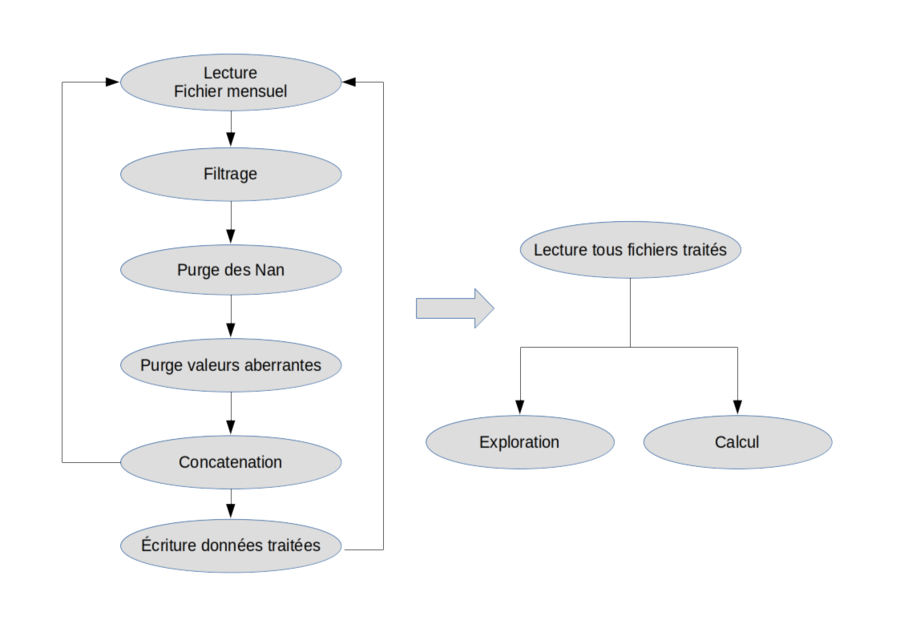
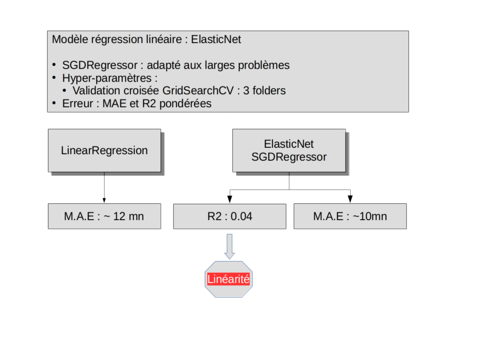

# 
<h1>Flights delays estimator</h1>

   
<h3>Abstract</h3>

This study aims to estimate flights delays based on US TRANSTATS database 
provided on [https://www.transtats.bts.gov](URL)

 

  * The slides present the overall approach of the study : <a href="URL">https://github.com/dataforcast/OC_Datascientist/blob/master/P4/soutenance/Openclassrooms_ParcoursDatascientist_P4-V1.pdf</a>
 
  * Jupyter notebook, Python source code :  <a href="URL">http://bit.ly/FBangui_Datascience_FlightDelayEstimator</a>
 

<h3>Study Overview :</h3>

 
* A Data model is built based on the dataset cleaning and exploratory analysis.
 

* The explicative variables are selected in order to remove data-leakage and 
data-correlation. 
 

Matrix correlation allows to detect correlated features : 

* A model is built based on routes. Study of delay variances per routes lead to 
suggest assumptions on data model variables.
 
Scheme below shows route building process between two airports.

 

 
Delay distribution shows a shifted central effect for east/west trafic. A climatic effect may be suspected.

 

* Model is augmented with the US climatic model.
 

* Linear regressors are evaluated based on an exhautive cross-validation. 
 

* The best estimator among linear regression estimators is selected based on performances measures. 

* An software engineering scheme is showned for the model to be deployed.

* Deployement scheme on Hereku is presented.
 

Upper part of slide below shows loading process on Heroku along with embedded database.

 
Middle part shows result of a request returned in JSON format. A set of random flights is returned from database.

 
Lower part of the slide shows result returned from a request for delay estimation. Note that both results are returned from two implemented algorithm in order to estimate variance of results.

* Conclusions present limits of this model and propositions to increase model preformances.
 

<h3>API on JSON format:</h3>

Following displays a random list of flights

 * [https://francois-bangui-oc-p4.herokuapp.com/predictor/?*](URL)

  
Flight delay evaluation  based of flight identifier : 

 * [https://francois-bangui-oc-p4.herokuapp.com/predictor/?flight_id=ID](URL) 
 
where ID is picked from previous output.

 
<h3>Software engineering</h3>

 

